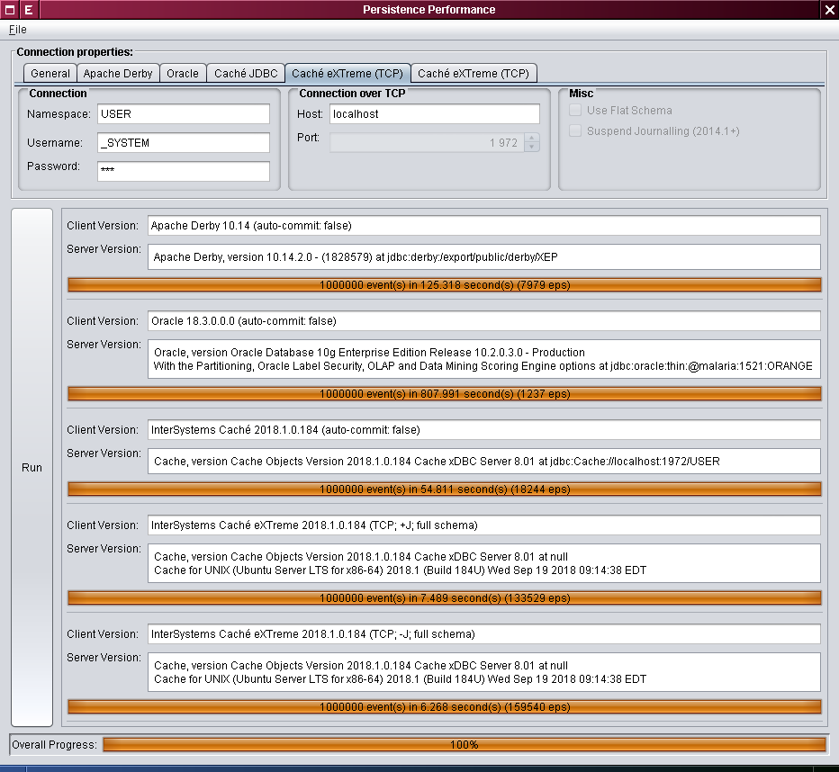
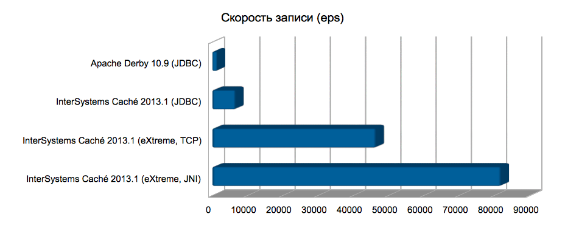

# Как считают звёзды? Использование InterSystems Caché eXTreme в Gaia

## Инструменты звездочётов

5 лет назад, 19 декабря 2013 года был запущен спутниковый телескоп _Gaia_.
Подробно о миссии Gaia можно прочитать на
[сайте Европейского Космического Агентства](http://sci.esa.int/gaia/) и в статье
Виталия Егорова (см.
[Billion pixels for a billion stars](https://translate.google.com/translate?sl=ru&tl=en&u=https%3A%2F%2Fzelenyikot.livejournal.com%2F25742.html)).

Однако мало кто знает, какую технологию разработчики ЕКА выбрали для обработки и
хранения данных, собираемых Gaia. Двумя годами ранее, в 2011 году, в качестве
кандидатов рассматривались (см.
[Astrostatistics and Data Mining](https://books.google.com/books?id=ys-e0SotvBoC&amp;lpg=PA109&amp;ots=ut05m7Pem5&amp;dq=Astrometric%20Global%20Iterative%20Solution%20Intersystems&amp;hl=ru&amp;pg=PA112#v=onepage&amp;q=Astrometric%20Global%20Iterative%20Solution%20Intersystems&amp;f=false)
by Luis Manuel Sarro, Laurent Eyer, William O'Mullane, Joris De Ridder, pp.
111-112):

 - _IBM DB2_,
 - _PostgreSQL_,
 - _[Apache Hadoop](https://hadoop.apache.org/)_,
 - _[Apache Cassandra](https://cassandra.apache.org/)_ и
 - _InterSystems Caché_ (точнее – технология _[Caché eXTreme Event Persistence](https://docs.intersystems.com/latest/csp/docbook/DocBook.UI.Page.cls?KEY=BXJV_xep)_. 
 
Сравнение технологий на производительность дало след. результаты ([источник](images/book-fragment.png)): 

| Технология   | Время    |
|--------------|---------:|
| DB2          | 13min55s |
| PostgreSQL 8 | 14min50s |
| PostgreSQL 9 |  6min50s |
| Hadoop       |  3min37s |
| Cassandra    |  3min37s |
| Caché        |  2min25s |
     
О первых четырёх "игроках" индустрии знает, наверное, едва ли не каждый
школьник. А вот что же такое _Caché XEP_?

## Java-технологии в Caché

Если посмотреть на стек Java API, предоставляемых компанией _InterSystems_, то
мы увидим примерно следующее:

 - Технология
 _[Caché Object Binding](https://docs.intersystems.com/latest/csp/docbook/DocBook.UI.Page.cls?KEY=BLJV)_,
 прозрачно проецирующая объектно-ориентированное представление данных на Java.
 В терминах _Caché_ сгенерированные прокси-классы Java так и называются –
 "projections". Данный подход наиболее прост в использовании, т. к. сохраняет
 "естественные" связи между классами в объектной модели, но при этом отличается
 достаточно низким быстродействием: "по проводам" передаётся достаточно много
 служебных метаданных, описывающих объектную модель.
 
 - JDBC и всевозможные надстройки (_Hibernate_, _JPA_). Здесь я, наверное, не
 скажу ничего нового, кроме того, что _Caché_ поддерживает два уровня изоляции транзакций:
 [`READ_UNCOMMITTED`](https://docs.oracle.com/javase/8/docs/api/java/sql/Connection.html#TRANSACTION_READ_UNCOMMITTED)
 и [`READ_COMMITTED`](https://docs.oracle.com/javase/8/docs/api/java/sql/Connection.html#TRANSACTION_READ_COMMITTED)
 – и по умолчанию работает в режиме `READ_UNCOMMITTED`.

 - Семейство _Caché eXTreme_ (также существующее в редакциях для
 _[.NET](https://docs.intersystems.com/latest/csp/docbook/DocBook.UI.Page.cls?KEY=BXNT)_
 и _[Node.js](https://docs.intersystems.com/latest/csp/docbook/DocBook.UI.Page.cls?KEY=BXJS)_).
 Этот подход характеризуется прямым доступом к низкоуровневому представлению
 данных (т. наз. "глобалам" – квантам информации в мире _Caché_), обеспечивающим
 очень высокую скорость работы. Библиотека _[Caché XEP](https://docs.intersystems.com/latest/csp/docbook/DocBook.UI.Page.cls?KEY=BXJV_xep)_
 одновременно предоставляет объектный и квази-реляционный доступ к данным.

   - Объектный – в том смысле, что клиенту API не нужно заботиться об
   объектно-реляционном отображении: по образу и подобию объектной модели Java
   (даже в случае сложного многоуровневого наследования)
   [автоматически создаётся](https://docs.intersystems.com/latest/csp/docbook/DocBook.UI.Page.cls?KEY=BXJV_xep_import)
   объектная модель на уровне классов _Caché_ (или схема БД, если перейти к
   терминам реляционного представления).

   - Квази-реляционный – в том смысле, что над множеством уже загруженных в БД
   "событий" [можно выполнять SQL-запросы](https://docs.intersystems.com/latest/csp/docbook/DocBook.UI.Page.cls?KEY=BXJV_xep_queries)
   (точнее, запросы, использующие подмножество SQL) прямо из контекста
   _eXTreme_-соединения, причём, более того,
   [индексы](https://docs.intersystems.com/latest/csp/docbook/DocBook.UI.Page.cls?KEY=BXJV_xep_events_indexing)
   и транзакции тоже поддерживаются. Разумеется, все загруженные данные
   становятся немедленно доступны через JDBC посредством реляционного
   представления (с возможностью использования всей мощи ANSI SQL плюс
   расширений SQL, характерных для диалекта _Caché_), но скорость доступа будет
   уже совсем другая.

Ещё раз, в качестве резюме, у нас есть:

 - импорт "схемы" (классы _Caché_ создаются автоматически), в т. ч.
 - импорт иерархии Java-классов;
 - мгновенный реляционный доступ к данным – с классами _Caché_ можно работать
 как с таблицами;
 - поддержка индексов и транзакций средствами _Caché eXTreme_;
 - поддержка простых SQL-запросов средствами _Caché eXTreme_;
 - поддержка произвольных SQL-запросов через лежащее в основе
 _eXTreme_-соединения JDBC-соединение.

Такой подход даёт некоторые преимущества и перед аналогичными реляционными
(более высокая скорость доступа), и перед разнообразными NoSQL-решениями
(немедленный доступ к данным в реляционном стиле).

Дополнительно можно сказать, что _eXTreme_-соединение может быть двух
видов: соединение, использующее JNI (но требующее, чтобы сервер Caché был
доступен локально – отличие от JDBC-соединения 2-го типа в том, что не
поддерживается передача данных по сети), и обычное TCP-соединение, где передача
данных осуществляется посредством стандартного JDBC-драйвера 4-го типа.

"Тонкость настройки" JNI-версии состоит исключительно в том, что нужно настроить
окружение:

 - переменная `GLOBALS_HOME` должна указывать на каталог, содержащий инсталляцию
 _Caché_, и
 - `LD_LIBRARY_PATH` (`DYLD_LIBRARY_PATH` для _Mac OS X_ или `PATH` для
 _Windows_) должна содержать `${GLOBALS_HOME}/bin`.

Для TCP-версии достаточно увеличить размер стека (stack) и кучи (heap) _JVM_
(`-Xss2m -Xmx768m`).

## Немного практики

Авторам было интересно, как ведёт себя _Caché eXTreme_ в задаче записи
непрерывного потока данных по сравнению с популярными технологиями обработки
данных. В качестве источника данных с сайта холдинга
"[Финам](https://www.finam.ru/profile/mirovye-indeksy/nasdaq/export/)"
были взяты исторические котировки в CSV-формате. Пример файла с данными:

```
<TICKER>,<PER>,<DATE>,<TIME>,<LAST>,<VOL>
NASDAQ100,0,20130802,09:31:07,3 125.300000000,0
NASDAQ100,0,20130802,09:32:08,3 122.860000000,806 906
NASDAQ100,0,20130802,09:33:09,3 123.920000000,637 360
NASDAQ100,0,20130802,09:34:10,3 124.090000000,421 928
NASDAQ100,0,20130802,09:35:11,3 125.180000000,681 585
```

Код класса _Caché_, моделирующего вышеприведённую структуру, может выглядеть вот
так:

```
Class com.intersystems.persistence.objbinding.Event Extends %Persistent [ ClassType = persistent, DdlAllowed, Final, SqlTableName = Event ]
{
Property Ticker As %String(MAXLEN = 32);

Property Per As %Integer(MAXVAL = 2147483647, MINVAL = -2147483648);

Property TimeStamp As %TimeStamp;

Property Last As %Double;

Property Vol As %Integer(MAXVAL = 9223372036854775807, MINVAL = -9223372036854775810);
}
```

Также был написан некий наивный тестовый код. Оправданием "наивности" может
послужить то, что мы измеряем всё-таки не скорость кода, сгенерированного _JIT_,
а скорость, с которой не имеющий отношения к _JVM_ код (за исключением _Apache
Derby_) умеет записывать на диск. Внешний вид окна тестовой программы:



В забеге участвовали:

 - _Apache Derby_ 10.14.2.0 (некоторые известные коммерческие реляционные СУБД
 показали схожую производительность)
 - _Oracle_ 10.2.0.3.0
 - _InterSystems Caché_ 2018.1 (JDBC)
 - _InterSystems Caché_ 2018.1 (eXTreme)

Сразу скажем, что в силу приближённости тестов мы не видим смысла в приведении
точных цифр: погрешность достаточно велика, и целью статьи является лишь
продемонстрировать общую тенденцию. Из тех же соображений, мы не указываем
точную версию JDK и настройки сборщика мусора: серверная JVM 8u191 с `-Xmx2048m
-Xss128m` показала схожую производительность на _Linux_ и _Mac OS X_. В каждом
из тестов сохранялось около миллиона событий; тесту для каждой отдельной БД
предшествовали несколько (до 10) "прогревающих" запусков. Что касается настроек
_Caché_, то кэш программ (routine cache) был увеличен до 256 МБ, а
восьмикилобайтный кэш БД (8kb database cache) – до 1024 МБ.

Результаты тестирования выглядят следующим образом (по горизонтали – скорость
записи, выраженная в events per second (eps), больше – лучше):



 1. _Derby_ и другие реляционные СУБД дают скорость записи, варьирующуюся от 1000 
 до 1500 eps.

 1. _Caché_ в JDBC-режиме даёт бóльшую скорость (от 6000 до 7000 eps), но эта
 скорость имеет свою цену: используемый по умолчанию уровень изоляции транзакций,
 как уже было сказано выше, – это `READ_UNCOMMITTED`.

 1. Далее, _Caché eXTreme_ даёт 45000-50000 eps в pure-Java-режиме и больше 80000
 eps при общении с локальным экземпляром _Caché_ через JNI.
 
 1. Наконец, если пойти на некоторый риск и
 [отключить транзакционный журнал](https://docs.intersystems.com/latest/csp/docbook/DocBook.UI.Page.cls?KEY=GMSM_management_journaling)
 (для отдельно взятого клиентского процесса), то на тестовой машине оказалось
 возможным довести скорость записи при JNI-соединении до 100000 eps.

Всем, кому интересны более точные цифры, предлагаем ознакомиться с
[исходным кодом](https://github.com/unix-junkie/persistence-benchmark). Для
сборки и запуска вам понадобятся:
 
 - _JDK_ 1.8+,
 - _Git_,
 - _Maven_ 
 - _[Maven Install Plugin](https://maven.apache.org/plugins/maven-install-plugin/)_
 для [создания локальных артефактов](https://maven.apache.org/guides/mini/guide-3rd-party-jars-local.html)
 _Caché JDBC_ и _Caché eXTreme_:
    ```
    $ mvn install:install-file -Dfile=cache-db-2.0.0.jar
    $ mvn install:install-file -Dfile=cache-extreme-2.0.0.jar
    $ mvn install:install-file -Dfile=cache-gateway-2.0.0.jar
    $ mvn install:install-file -Dfile=cache-jdbc-2.0.0.jar
    ```
 - _Caché_ 2018.1+.
